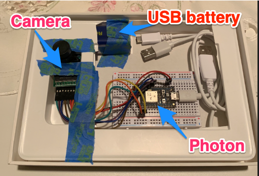
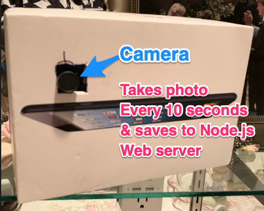
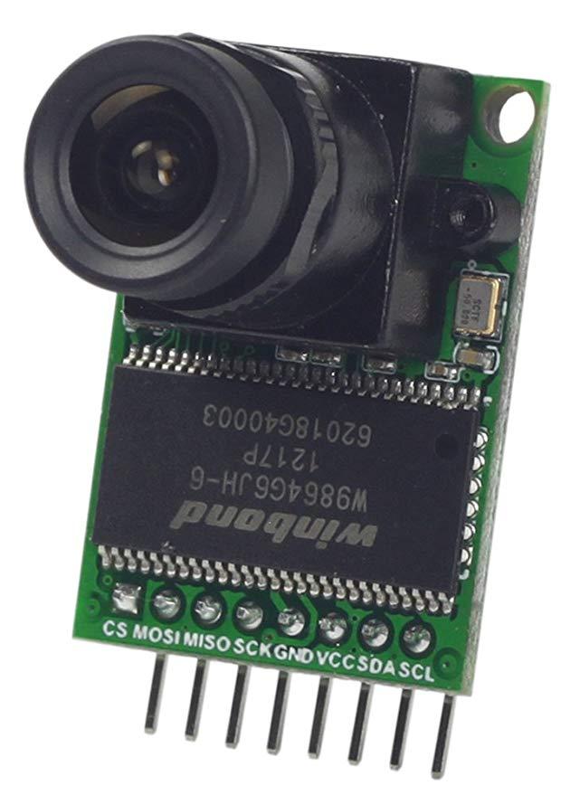
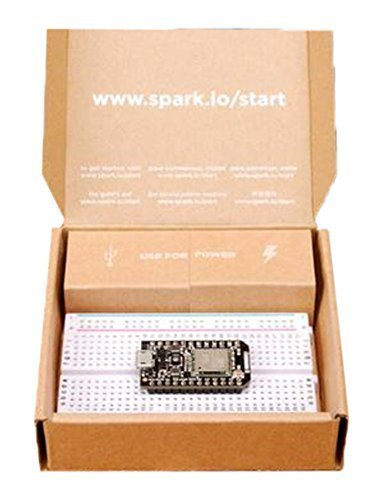
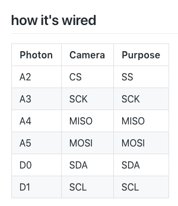

# camera

  

### Preparation:

1. Buy ArduCam Mini Module 
https://www.amazon.com/Arducam-Module-Camera-Arduino-Mega2560/dp/B013JUKZ48
 
2. Buy Particle Photon Development Kit
https://www.amazon.com/Particle-Development-Prototyping-Breadboard-Electronics/dp/B012D6UYTA  
 
3. Wiremap for Camera/Photon  
 
       GND - GND 
       VCC - VIN 

### Connect and take photos every 10 Seconds

1. Install Node.js (see https://nodejs.org/en/)
2. Download and install Particle Dev to Mac/PC & Login 
https://docs.particle.io/guide/tools-and-features/dev/ 
3. Fork and Clone https://github.com/dmiddlecamp/particle_arducam
4. Copy particle_arducam/firmware/tcp_photographer/main.ino to particle_arducam/firmware/library2/
5. Get local IP address of computer and update line 9 of main.ino
6. From Particle Dev go to File > Add Project Folder
7. Browse out and click on particle_arducam/firmware/library2/ and add to Particle Dev
8. Click on Library2 folder in Particle Dev 
9. Click Compile in Cloud and Show any Errors button (cloud icon)
10. Click Compile in Cloud and upload code using cloud (flash icon)
11. Create folder named images in particle_arducam/firmware/services/tcp_server
12. Use command prompt to CD to particle_arducam/firmware/services/tcp_server
13. Use commands 
npm install
node main.js

You should now see:

Listening for TCP packets on port 5550 ...
Connection received
saving image
writing 492329 bytes to file
